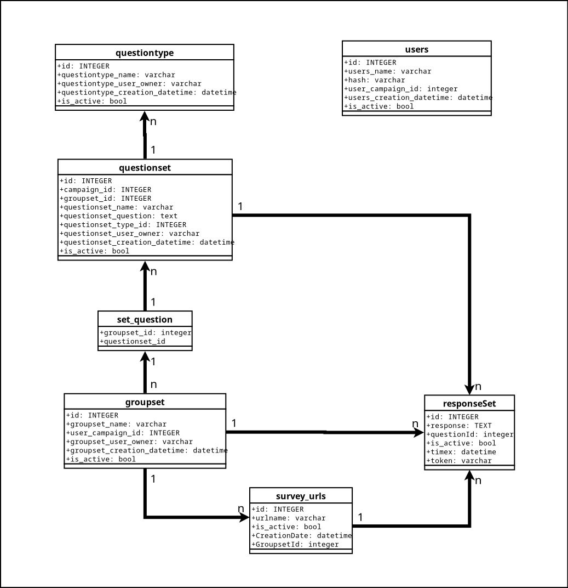
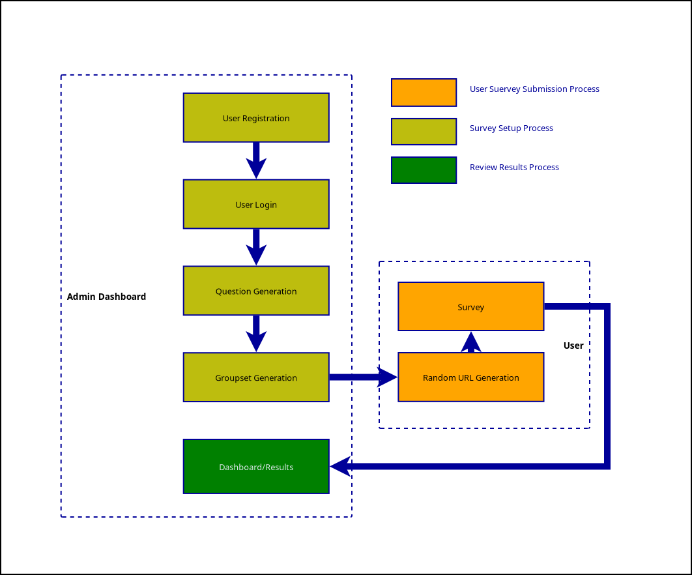
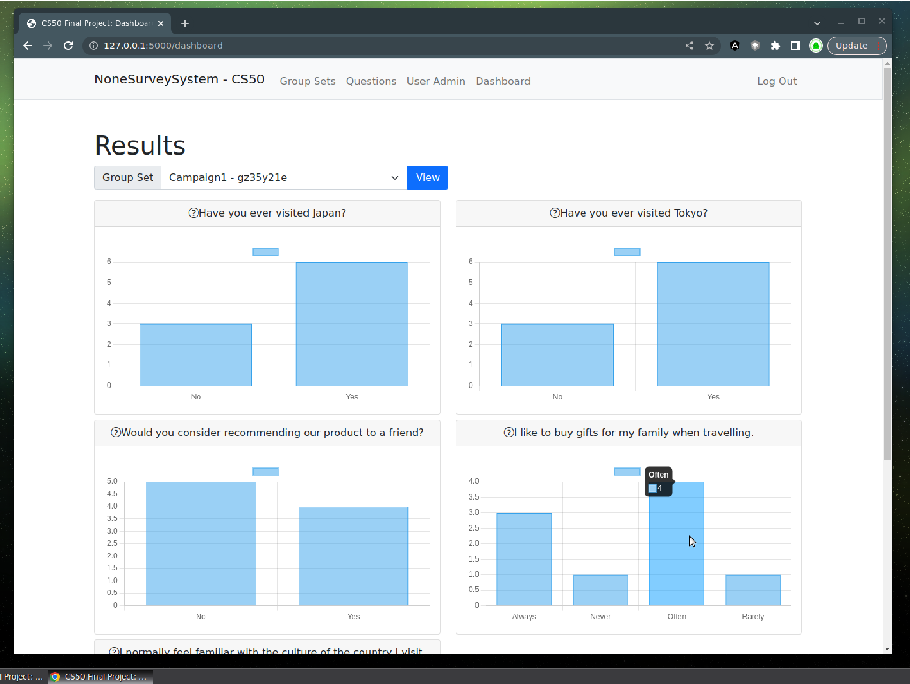
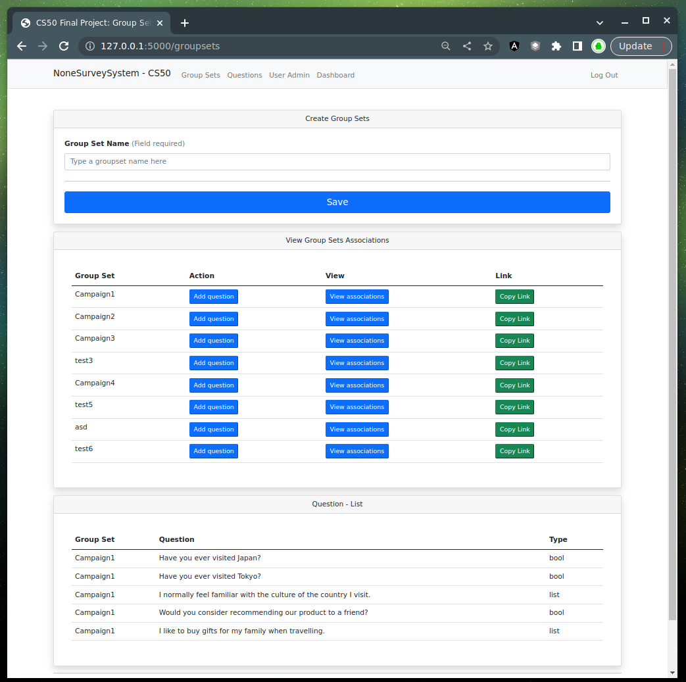
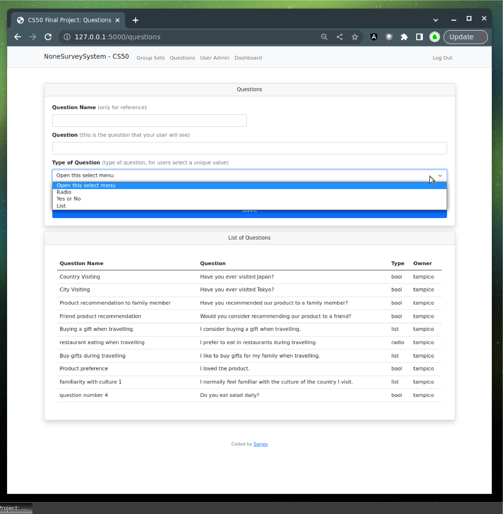

# NoneSurveySystem
---

#### Video Demo:  https://youtu.be/4WOiZkpYgmk

##### Data model

##### Usage Diagram

### Application interface

##### Description

- The application was designed thinking in the anonymous feedback that can be obtained from general users, they might be students, users, colleagues, mates, customers, clients, etc
3 Type of data can be generated from it:
    - List (Always to Never)
    - bool (Yes or No Questions)
    - Radio buttons (Strongly agree to Strongly disagree)

- The application allows to create a set of questions, then group them in something called "Group Sets" and then generates a random unique url so external users (no registered/logged) will be able to submit a survey created. After the survey is completed, the registered user or admin, will be able to preview the results in a graph sorted by questions.

- The application uses the ability of Python Flask to create API REST that makes flexible the process of consulting information externally from the front end, making the application much faster and reducing workloads in the backend.

- The general process is fetch the endpoint accordingly, requesting or sending data and receiving a response to deny access or confirm an operation according to the endpoint used.

- The questions are rendered from the backend, using the function "render_template" from flask; the rest of the rendering processes are in the front-end using vanilla js.

- The database was designed to make 6 entities interact and the information is consolidated from javascript, so it is displayed in the front much faster.

##### Design choices

- At the beggining I planned to use entirely the `render_template` feature of Flask, but then I started to investigate an easier way render the user interface (including fetching the api), it was easier from the dev experience, however, I found that from the User Experience Perspective, it was much more comfortable and efficient to use javascript. So multiple screens and functionalities were created entirely in javascript.

- The biggest challenge of the project was to design the rendering part of the questions to the end user, the reason was that questions were stored in the database and they were dynamic (meaning, not static information) so when creting the script in the database, I had to create a unique datastructure that allowed me to iterate over tables to obtain the right information and then concatenate the results in order to send only one piece of information to the front end. 

- The second biggest challenge was to render the questions in hte front-end, since the data-structure was unique, so I had to use functions like `map` (in a nested way), in order iterate over objects.

- The interesting and nice part was to use a graphic library like `ChartJs` and handle the dat in such way that was able to create the data as the library required.

##### Usage

- Register
- Login
- Create a Questions
- Created a Groupset
- Add questions to your Groupset
- Copy the link
- Send the link to users in general
- Submit surveys
- Preview results from the dashboard

##### List Of Features:

- User Registration
- User Login
- User Logout
- User Creation confirmation
- User password Change
- Question creation (Questions that end users will answer)
- Group Set creation (A group of questions, when Groupset is created, the application automatically publish a url accessible publicly -no need to log in to submit a survey-)
- Group Set association (Associate a question with the Group Set)
- Group Set visualization (no need to refresh, the application is smart enough to automatically shows the information, based on the option clicked in the interface)
- Confirmation of successful link a question to a Groupset
- Automatic creation of a random and unique url that allow users externally to submit answers
- Preview in real time responses submitted by users
- Selection of the Groupsets to preview in the Results Dashboard
- Update Groupset-questions by clicking a button (no need to refresh the page to view changes)
- Prevent submit an empty questions/groupset
- Ability for external users to access the survey and submit questions
- Ability to prevent users to submit questions that are empty

##### Tech Stack used:
- Backend:
	- Python 3
	- Framework: Flask 2.2.2
	- Database Library: CS50 9.2.2
	- Database: SQLite 3 (Local Setup)
- Front:
	- Vanilla Javascript (Local files)
	- CSS: Bootstrap 5.2 (CDN)
	- Chratjs (CDN)
	- Jquery (CDN)
- Data Integration
	- API RESTful
	- HTML rendering from backend

##### List of Endpoints

- `/`
	- Main endpoint login required.

- `/qra`
	- Methods "POST"
	- Returns the user submissions to be rendered by the js application
	- Uses a token for extra security layer

- `/dashboard`
	- "methods "GET" and "POST"
	- Renders the dashboard to preview results of submissions

- `/login`
	- methods "GET" and "POST"
	- Creates a session for a registered user, validating credentials in DB

- `/questions
	- methods "GET" and "POST"
	- Allows to create new questions

- `/campaigns`
	- -Feature is not implemented
	- This endpoint will allow to created groups of groupsets called, Campaigns

- `/getsets/<set1>`
	- methods "GET" and "POST"
	- Returns the group of questions from a groupset number

- `/addsets`
	- methods "GET" and "POST"
	- Endpoint to create a new association Group Set to Question

- `/groupsets`
	- methods "GET" and "POST"
	- Creates a new groupset and save it into the database

- `/register`
	- methods "GET" and "POST"
	- Creates a new users and saves it into the database after multiple validations

- `/createSurvey`
	- methods "POST"
	- Creates a new random/unique URL record, returns a json object

- `/survey/<surveyToken>`
	- methods "GET"
	- Allows external GET access to the survey

- `/userresponses`
	- methods "GET" and "POST"
	- Saves responses submitted by users

- `/usermanagement`
	- methods "GET" and "POST"
	- Change the password of a specific user

- `/logout`
	- methods "GET" and "POST"
	- Deletes the actual sessions (if exist)

##### Installation:

- Create the db file, and create schema
    - `sqlite3 dbx.db`
    - `.read dbx_schema.sql`
- Verify the Database:
    - `sqlite3 dbx.db`
    - `.schema`

- Install from `requirements.txt`
    - `pip install -r requirements.txt`

- Environment configuration:
	- Configure with no `.env` file:
    	- `$ export FLASK_APP=app_final.py`
    	- `$ export FLASK_ENV=development`
		- `$ export AUTH_TOKEN=jaraelgato128`

	- Configure with `.env` include the following lines in it:
    	- FLASK_APP=app.py
    	- FLASK_DEBUG=True
    	- AUTH_TOKEN=jaraelgato128

- To run the the application, just type:
	- `flask run`

